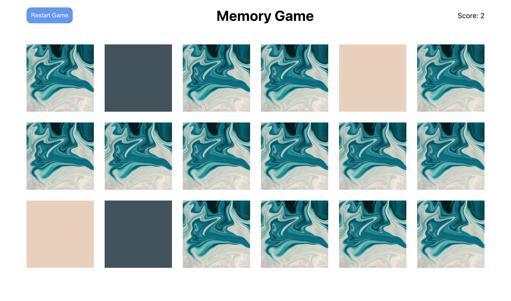

<!-- AUTO-GENERATED-CONTENT:START (STARTER) -->
<p align="center">
  <a href="https://cool-vacherin-fe385b.netlify.app">
  </a>
</p>
<h1 align="center">
Memory Card Game</h1>

<p align="center">A memory card game built with React, Zustand, and Emotion.</p>




<!-- FRAMEWORKS -->
## Built With

* [React](https://reactjs.org/)
* [Zustand](https://github.com/pmndrs/zustand)
* [Emotion](https://emotion.sh/docs/styled)


<!-- GETTING STARTED -->
## Getting Started

Clone the repo
```
git clone https://github.com/izabellewilding/memory-card-game-react
cd memory-card-game-react
```

Install dependencies 
```
yarn
```
Start the development server
```
yarn start
```

visit http://localhost:3000
```


Izabelle Wilding - izabellewilding@gmail.com

